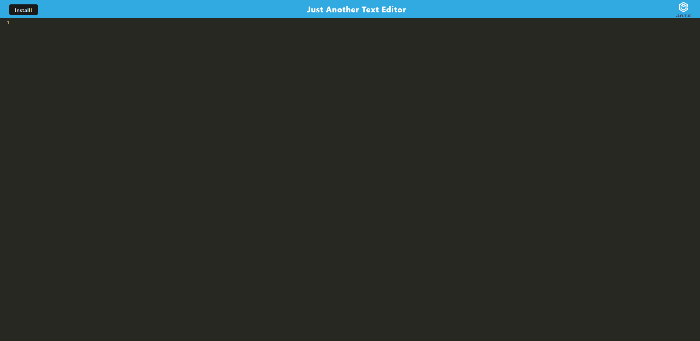
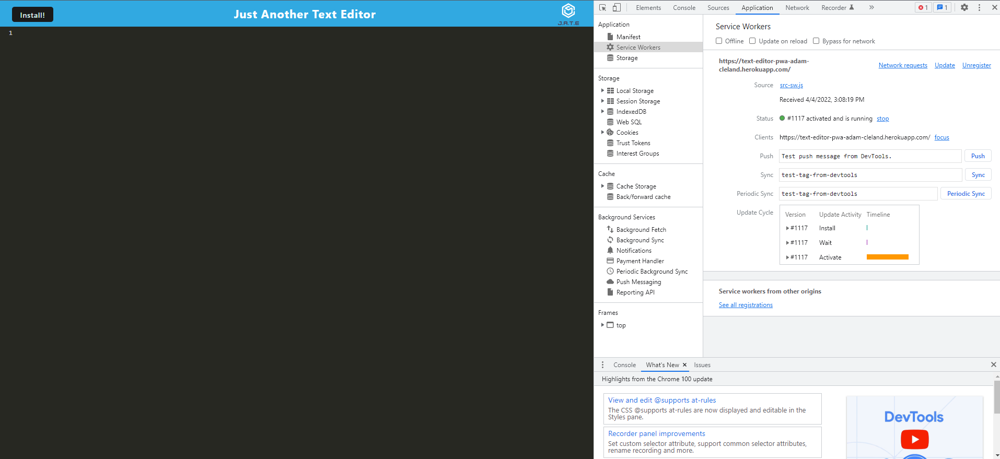
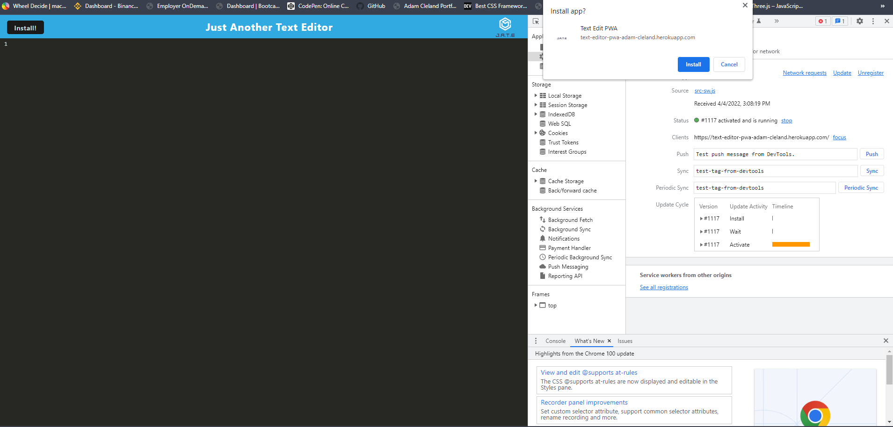

# Text-Editor-PWA-Adam-Cleland

We are tasked with creating a progressive web application that will retain its functionality even when the user is offline. This project is a portfolio assignment for the Ohio State Full Stack coding boot camp. We have been given starter code for the application and are tasked with refactoring it and turning it into a PWA. The primary goal for this assignment was to create a webpack kit in order for the application to be bundled into a dist file for the public to utilize.

## Table of contents

---

- **Usage Information**
- **Live Application**
- **Screenshots**
- **Contributions**
- **Questions**
- **License**

## Usage Information

---

You can clone the repo and run on your local device using the command npm start while you are cd'd into the proper directory.
Alternatively you can goto the live application that is hosted on heroku. The link is below.

## Live Application Link

---

The application is deployed through heroku.
[Live Web Site](https://text-editor-pwa-adam-cleland.herokuapp.com/)

## ScreenShots

---

## Contributions

---

Pull requests are welcome. For major changes, please open an issue first to discuss what you would like to change.

## Questions

---

### For Any Questions about the Application feel free to reach out to me on:

Github: [aclelandx](https://github.com/aclelandx)

Email: <aClelandx@gmail.com>

## License

---

Copyright [2022] [Adam Cleland]

        Permission is hereby granted, free of charge, to any person obtaining a copy of this software and associated documentation files (the "Software"), to deal in the Software without restriction, including without limitation the rights to use, copy, modify, merge, publish, distribute, sublicense, and/or sell copies of the Software, and to permit persons to whom the Software is furnished to do so, subject to the following conditions:

        The above copyright notice and this permission notice shall be included in all copies or substantial portions of the Software.

        THE SOFTWARE IS PROVIDED "AS IS", WITHOUT WARRANTY OF ANY KIND, EXPRESS OR IMPLIED, INCLUDING BUT NOT LIMITED TO THE WARRANTIES OF MERCHANTABILITY, FITNESS FOR A PARTICULAR PURPOSE AND NONINFRINGEMENT. IN NO EVENT SHALL THE AUTHORS OR COPYRIGHT HOLDERS BE LIABLE FOR ANY CLAIM, DAMAGES OR OTHER LIABILITY, WHETHER IN AN ACTION OF CONTRACT, TORT OR OTHERWISE, ARISING FROM, OUT OF OR IN CONNECTION WITH THE SOFTWARE OR THE USE OR OTHER DEALINGS IN THE SOFTWARE.
